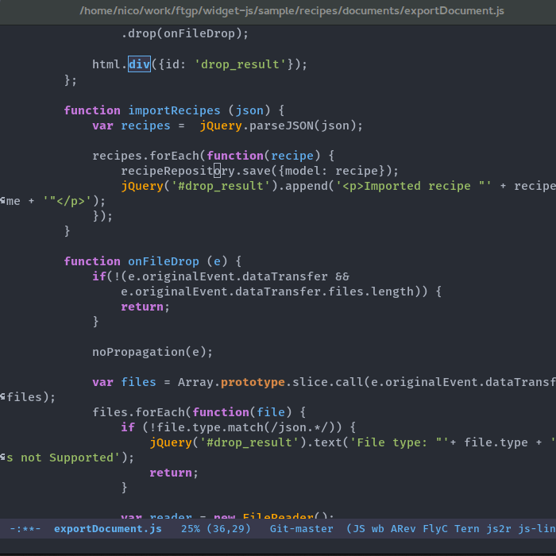
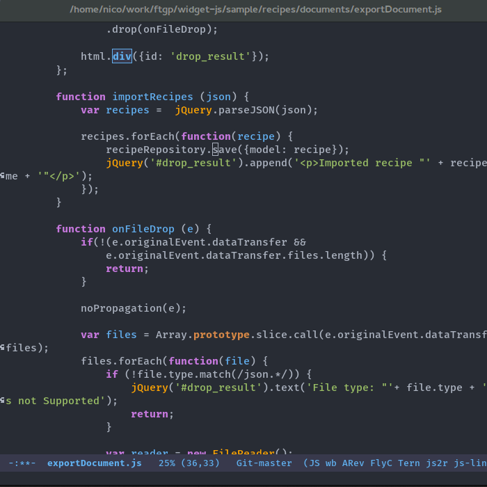

# xref-js2

The GitHub repository is mirrored from [https://petton.fr/git/nico/xref-js2](https://petton.fr/git/nico/xref-js2).

`xref-js2` adds navigation to definitions or references to JavaScript projects
in Emacs.

`xref-js2` adds an xref backend for JavaScript files.

Instead of using a tag system, it relies on `ag` to query the codebase of a
project.  This might sound crazy at first, but it turns out that `ag` is so fast
that jumping using `xref-js2` is most of the time instantaneous, even on fairly
large JavaScript codebases (it has been tested on 50k lines of JS code).

Because line by line regexp search has its limitations, `xref-js2` does a second
pass on result candidates and eliminates possible false positives using
`js2-mode`'s AST, thus giving very accurate results.

## Requirements

- Emacs 25.1
- `ag` (the [silver searcher](http://geoff.greer.fm/ag/))
  - or `rg` ([ripgrep](https://github.com/BurntSushi/ripgrep))
- js2-mode

## Installation

If you use `js2-mode`, `M-.` will be bound by `js2`, you might want to unbind it:

```elisp
(define-key js2-mode-map (kbd "M-.") nil)
```

Then you need to add the xref backend:

```elisp
(add-hook 'js2-mode-hook (lambda ()
  (add-hook 'xref-backend-functions #'xref-js2-xref-backend nil t)))
```

## Customisations
By default, `xref-js2` will use `ag` for search operations, to switch to using `rg` put the following into your config file and ensure the ripgrep executeable is visible from your **PATH** environment variable:

```elisp
(setq xref-js2-search-program 'rg)
```

If you have issues with `xref-js2` using `rg` not searching certain files, ensure the extension of those files is included in `xref-js2-js-extensions`.

You can further customize the execution of `ag` or `rg` by `xref-js2` by changing `xref-js2-ag-arguments` & `xref-js2-rg-arguments` respectively. Though take care when doing so, many of these are used to produce an output which `xref-js2` can understand.

## Keybindings

`xref-js2` uses the `xref`, so the same keybindings and UI as other xref backends is used:

- `M-.` Jump to definition
- `M-?` Jump to references
- `M-,` Pop back to where `M-.` was last invoked

## Demo

### Jumping to definitions and back


### Finding references

